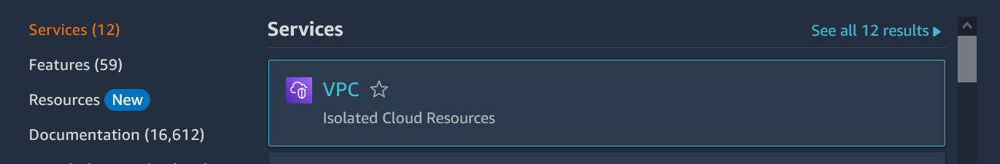
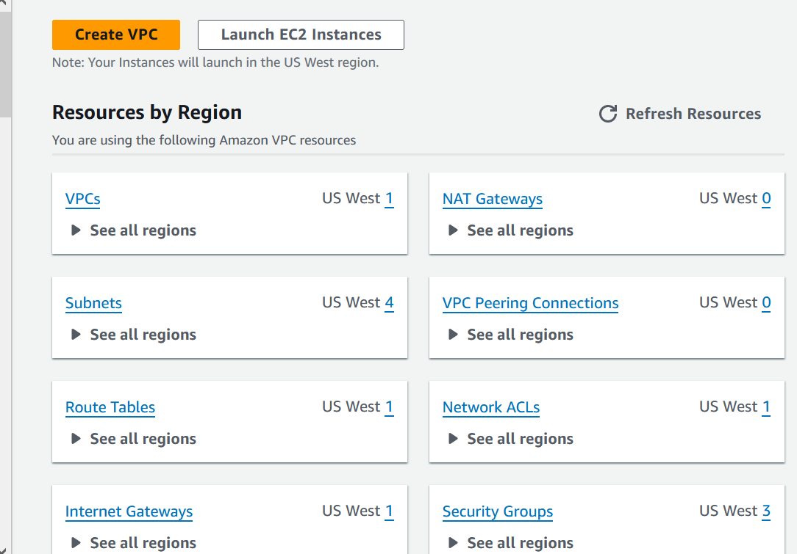

# Ipv6-for-AWS-VPC-and-Ec2

# MASTERING IPV6: A 
COMPREHENSIVE GUIDE TO 
CONFIGURING AND UTILIZING
IPV6 FOR AWS VPC AND EC2

In the ever-evolving landscape of cloud computing, change is inevitable. As of February 1,
2024, AWS is introducing a new charge for public IPv4 addresses, marking a significant shift
in the way we approach and utilize these resources.

Starting now, there will be a charge of $0.005 per IP per hour for all public IPv4 addresses,
whether attached to a service or not. This adjustment aims to reflect the increasing scarcity 
of IPv4 addresses and the rising costs associated with acquiring them, which have surged by 
more than 300% over the past 5 years.

This change applies universally to all AWS services, including popular ones like Amazon EC2,
Amazon RDS, and Amazon EKS, impacting in-use public IPv4 addresses, additional Elastic IP addresses
on running EC2 instances, and idle Elastic IP addresses in your account.

## Why the Change?

The shift in pricing is not merely a financial adjustment but a call to action. IPv4 addresses
are becoming a limited resource, and the new charge serves as a reminder to be mindful of our usage.
It encourages users to contemplate accelerating their adoption of IPv6—a forward-thinking solution 
for modernization and conservation.

## IPv6: The Future is Now

IPv6 addresses offer a vast pool of available addresses, ensuring a sustainable future for our cloud
infrastructure. As we adapt to the changing landscape, understanding how to use IPv6 addresses becomes 
crucial for optimizing resources and building a more resilient and scalable system.

## What’s Next?

This adjustment is not just a billing change; it’s an opportunity for growth and evolution. As we embrace
IPv6, we position ourselves for a future where resources are abundant, and our systems are more efficient
and sustainable.

Stay tuned as we delve into the world of IPv6, exploring its benefits, implementation strategies, and how
it can transform the way we approach cloud computing. The journey towards a more scalable and future-proof
cloud infrastructure begins now.

## How we can add IPV6 in our AWS account

Search for VPC in your AWS account & select VPC

Click on Vpcs

